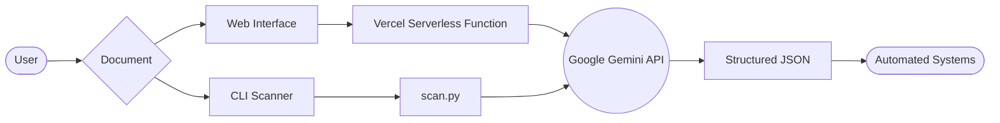

# 📄 Catastro AI: Gemini JSON OCR


> **Transform complex legal and cadastral documents into structured JSON data using the power of Google Gemini AI.**

Catastro AI is a modern solution for intelligent document processing (IDP). It leverages [Google Gemini](https://ai.google.dev/) to analyze visual documents (PDFs, images) and extract precise, structured information without the need for manual data entry or complex rule-based OCR.

---

## ✨ Features

- 🔍 **Intelligent OCR**: Powered by Gemini 2.0 Flash for superior visual understanding.
- 📊 **Structured Output**: Direct transformation of documents into validated JSON.
- 🇲🇽 **Mexican Document Focus**: Optimized for Cédulas Catastrales, Actas Constitutivas, and more.
- 🚀 **Dual Interface**: Use it via the elegant **Web UI** or the powerful **CLI script**.
- ⚡ **Vercel Ready**: Built to be deployed instantly as a serverless application.

---

## 🏗 Architecture



---

## 🚀 Getting Started

### 1. Prerequisites
- Get your **Google API Key** at [Google AI Studio](https://aistudio.google.com/app/apikey).
- (For CLI) Install [uv](https://docs.astral.sh/uv/):
  ```powershell
  # Windows
  powershell -ExecutionPolicy ByPass -c "irm https://astral.sh/uv/install.ps1 | iex"
  ```

### 2. Configuration
Create a `.env` file:
```env
GOOGLE_API_KEY=your_api_key_here
GEMINI_MODEL=gemini-2.0-flash
```

### 3. Usage

#### **Option A: Web Interface (Recommended)**
```bash
npm install
npm run dev
```
Open `http://localhost:3000` to start uploading documents.

#### **Option B: CLI Scanner**
```bash
uv run scan.py "C:\path\to\your\pdfs"
```

---

## 📖 Documentation

- [**Guía Detallada (Español)**](file:///c:/Users/cuell/OneDrive/Documentos/Code/Gemini-Json-OCR/gemini-json-ocr-main/gemini-json-ocr-main/README_DETALLADO.md) - Full technical specifications and architecture.
- [**Deployment Guide**](file:///c:/Users/cuell/OneDrive/Documentos/Code/Gemini-Json-OCR/gemini-json-ocr-main/gemini-json-ocr-main/DEPLOY_VERCEL.md) - How to host your own instance.

---

## 🛠 Advanced Usage

The extraction logic is governed by `prompt.txt`. You can customize this file to add support for new document types or change the JSON schema requirements.

---

## 📄 License

MIT License - Copyright (c) 2026 Catastro AI Team
