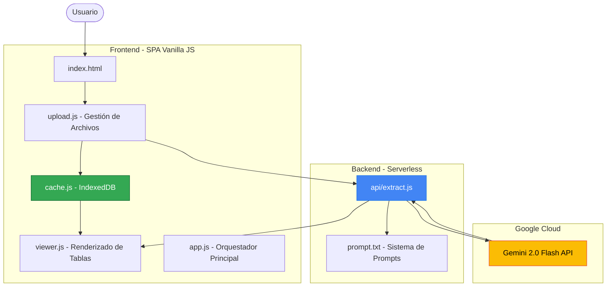
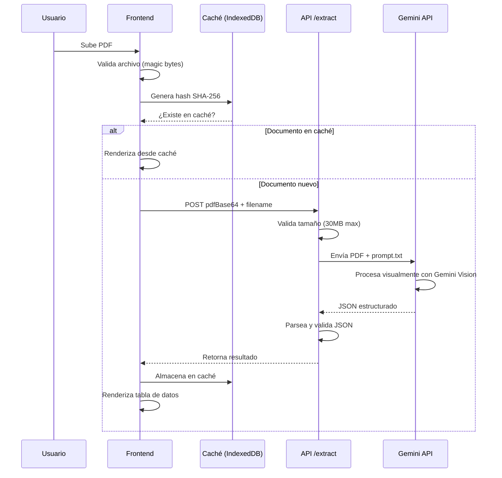

# 📄 Catastro AI: Gemini JSON OCR

> **Sistema inteligente de extracción de datos de documentos legales y catastrales mexicanos usando Google Gemini AI**

[](LICENSE)
[](https://ai.google.dev/)
[](DEPLOY_VERCEL.md)

---

## 🎯 Visión General

Catastro AI es una solución moderna de **Procesamiento Inteligente de Documentos (IDP)** que transforma documentos legales complejos en datos JSON estructurados y validados. Utiliza el modelo [Google Gemini Vision](https://ai.google.dev/) para analizar documentos visualmente sin necesidad de OCR tradicional basado en reglas.

### ✨ Características Principales

- 🔍 **OCR Inteligente Multimodal**: Gemini 2.0 Flash procesa PDFs como imágenes completas
- 📊 **Salida JSON Estructurada**: Transformación directa a formato validado y tipado
- 🇲🇽 **Especializado en Documentos Mexicanos**: Optimizado para Cédulas Catastrales, Actas Constitutivas, Certificados de Gravamen y Contratos
- 💾 **Caché Local Inteligente**: IndexedDB almacena resultados para acceso instantáneo
- 🎨 **Interfaz Web Moderna**: UI responsiva con tema claro/oscuro
- ⚡ **Doble Modo de Uso**: Interfaz web interactiva + CLI para procesamiento batch
- 🚀 **Listo para Producción**: Despliegue instantáneo en Vercel o Cloud Run

---

## 🏗️ Arquitectura del Sistema



### Componentes Clave

| Componente | Tecnología | Función |
|------------|-----------|---------|
| **Frontend** | Vanilla JS + CSS Variables | Interfaz de usuario modular y reactiva |
| **Caché** | IndexedDB | Almacenamiento local de documentos procesados |
| **API** | Node.js Express (Vercel Serverless) | Endpoint de extracción `/api/extract` |
| **Motor de IA** | Google Gemini 2.0 Flash | Procesamiento visual de documentos |
| **CLI** | Python (uv) | Script automático para carpetas de PDFs |

---

## 🚀 Inicio Rápido

### Prerrequisitos

1. **API Key de Google Gemini**  
   Obtén tu clave en [Google AI Studio](https://aistudio.google.com/app/apikey)

2. **Node.js 18+** (para interfaz web)

3. **Python 3.12+** y [uv](https://docs.astral.sh/uv/) (para CLI)
   ```powershell
   # Windows
   powershell -ExecutionPolicy ByPass -c "irm https://astral.sh/uv/install.ps1 | iex"
   ```

### Configuración

1. **Clonar e instalar dependencias**
   ```bash
   git clone <repository-url>
   cd gemini-json-ocr-main
   npm install
   ```

2. **Configurar variables de entorno**
   ```bash
   cp .env.example .env
   ```
   
   Editar `.env`:
   ```env
   GOOGLE_API_KEY=tu_api_key_aqui
   GEMINI_MODEL=gemini-2.0-flash
   ```

### Uso

#### 🌐 Opción A: Interfaz Web (Recomendado)

```bash
npm run dev
```

- Abre `http://localhost:3000`
- Arrastra y suelta un PDF o haz clic para seleccionar
- Los resultados se muestran en tabla estructurada
- Los documentos procesados se cachean automáticamente

#### 💻 Opción B: CLI para Procesamiento Batch

```bash
uv run scan.py "C:\ruta\a\carpeta\con\pdfs"
```

- Procesa todos los PDFs en la carpeta
- Genera archivos `.json` con los resultados
- Usa `--overwrite` para reemplazar archivos existentes

---

## 📖 Cómo Funciona

### 1️⃣ Flujo de Procesamiento



### 2️⃣ Ingeniería de Prompts

El archivo `prompt.txt` contiene el sistema de prompts que instruye a Gemini para extraer información específica. Define:

- **Rol del modelo**: Asistente experto en documentos legales mexicanos
- **Esquemas JSON**: Estructuras para cada tipo de documento
- **Reglas de extracción**: Manejo de datos faltantes, formatos esperados
- **Validación**: Asegura salida JSON pura (sin markdown)

**Ejemplo de esquema para Cédula Catastral:**
```json
{
  "tipo_documento": "Cedula Catastral",
  "clave_catastral": "string",
  "propietarios": ["string"],
  "domicilio": {
    "calle": "string",
    "municipio": "string"
  },
  "superficies": {
    "terreno_m2": "number",
    "construccion_m2": "number"
  },
  "valores_catastrales": {
    "valor_total": "string"
  }
}
```

### 3️⃣ Frontend Modular

La arquitectura frontend sigue el patrón **Module Pattern** para separación de responsabilidades:

- **`app.js`**: Orquesta todos los módulos y gestiona el estado global
- **`upload.js`**: Maneja drag & drop, validación de archivos y comunicación con API
- **`cache.js`**: Interfaz con IndexedDB para persistencia local
- **`viewer.js`**: Renderiza JSON como tablas HTML estructuradas

### 4️⃣ Caché Inteligente

Utiliza **IndexedDB** para almacenar resultados procesados:

- **Hashing SHA-256**: Identifica documentos únicos sin procesamiento duplicado
- **Consulta instantánea**: Carga resultados sin llamar a la API
- **Gestión de historial**: Lista de documentos procesados con timestamps

---

## 📊 Documentos Soportados

| Tipo de Documento | Campos Extraídos | Casos de Uso |
|-------------------|------------------|--------------|
| **Cédula Catastral** | Clave catastral, propietarios, superficies, colindancias, valores | Verificación de propiedades, valuación |
| **Acta Constitutiva** | Razón social, socios, capital, administración, datos notariales | Due diligence, compliance |
| **Certificado de Libertad/Gravamen** | Folio real, gravámenes, acreedores, situación jurídica | Análisis de riesgos crediticios |
| **Contrato de Compraventa** | Partes, inmueble, precio, registro anterior | Automatización de transacciones |

---

## 🔧 Configuración Avanzada

### Variables de Entorno

```env
# Obligatorio
GOOGLE_API_KEY=AIza...                    # Tu API key de Google

# Opcional
GEMINI_MODEL=gemini-2.0-flash             # Modelo a utilizar
PORT=3000                                 # Puerto del servidor de desarrollo
NODE_ENV=production                       # Modo de ejecución
ALLOWED_ORIGIN=*                          # CORS (usa dominio en producción)
```

### Personalización del Prompt

Puedes modificar `prompt.txt` para:
- Agregar nuevos tipos de documentos
- Cambiar esquemas JSON de salida
- Ajustar instrucciones de extracción
- Agregar validaciones específicas

---

## 🚀 Despliegue en Producción

### Vercel (Recomendado)

```bash
npm install -g vercel
vercel --prod
```

Ver [DEPLOY_VERCEL.md](DEPLOY_VERCEL.md) para instrucciones detalladas.

### Google Cloud Run

```bash
gcloud builds submit --tag gcr.io/[PROJECT-ID]/catastro-ai
gcloud run deploy catastro-ai --image gcr.io/[PROJECT-ID]/catastro-ai
```

Ver [DEPLOY_CLOUDRUN.md](DEPLOY_CLOUDRUN.md) para más información.

---

## 📚 Documentación Adicional

- **[Arquitectura Técnica](documentation/ARQUITECTURA.md)**: Diseño detallado del sistema
- **[Guía de API](documentation/API.md)**: Especificación del endpoint `/api/extract`
- **[Sistema de Prompts](documentation/PROMPTS.md)**: Ingeniería de prompts y esquemas
- **[Desarrollo Frontend](documentation/FRONTEND.md)**: Arquitectura de componentes JS

---

## 🛠️ Stack Tecnológico

### Backend
- **Runtime**: Node.js 18+ (ES Modules)
- **Framework**: Express.js
- **IA**: Google Gemini SDK (`@google/genai`)
- **Validación**: Magic bytes, límites de tamaño

### Frontend
- **Arquitectura**: Vanilla JS (sin frameworks)
- **Estilos**: CSS Variables + Flexbox/Grid
- **Persistencia**: IndexedDB API
- **Criptografía**: SubtleCrypto (SHA-256)

### CLI
- **Lenguaje**: Python 3.12+
- **Gestor**: uv (package manager rápido)
- **SDK**: `google-genai` (Python)

---

## 🔐 Seguridad

- ✅ Validación de magic bytes PDF (`%PDF-`)
- ✅ Límites de tamaño de archivo (30MB)
- ✅ Rate limiting (10 req/min por IP)
- ✅ Sanitización de salida HTML (escape de caracteres)
- ✅ Headers de seguridad (CSP, X-Frame-Options)

---

## 🤝 Contribuciones

Las contribuciones son bienvenidas. Para cambios importantes:

1. Abre un issue para discutir el cambio
2. Fork el repositorio
3. Crea una rama feature (`git checkout -b feature/amazing-feature`)
4. Commit tus cambios (`git commit -m 'Add amazing feature'`)
5. Push a la rama (`git push origin feature/amazing-feature`)
6. Abre un Pull Request

---

## 📄 Licencia

MIT License - Copyright (c) 2026 Catastro AI Team

---

## 💡 Próximos Pasos

- [ ] Agregar autenticación con Google OAuth
- [ ] Implementar procesamiento batch asíncrono
- [ ] Exportar a Excel/CSV además de JSON
- [ ] Panel de administración con métricas
- [ ] Soporte para más tipos de documentos

---

## 📞 Soporte

¿Problemas o preguntas? Consulta:
- [Documentación técnica](documentation/)
- [Issues del proyecto](../../issues)
- [Google AI Documentation](https://ai.google.dev/docs)

---

<div align="center">
  <strong>Hecho con ❤️ usando Google Gemini AI</strong>
</div>
