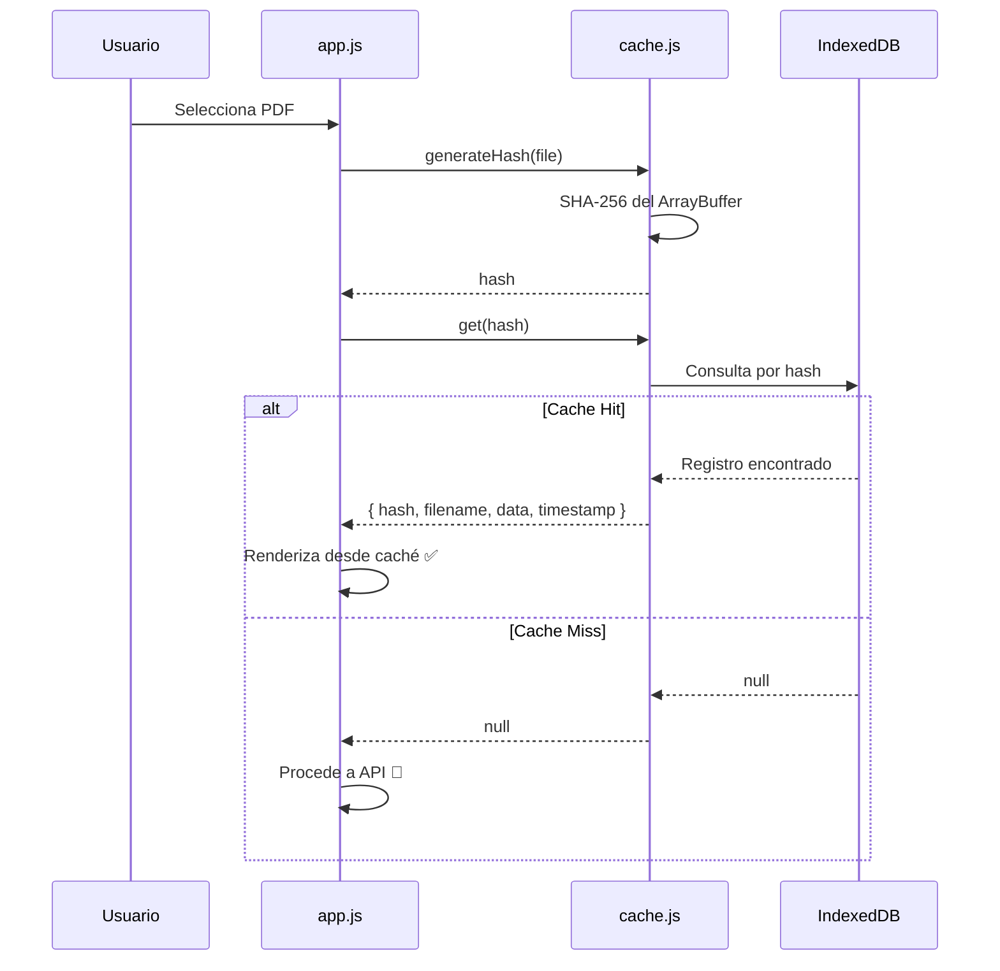
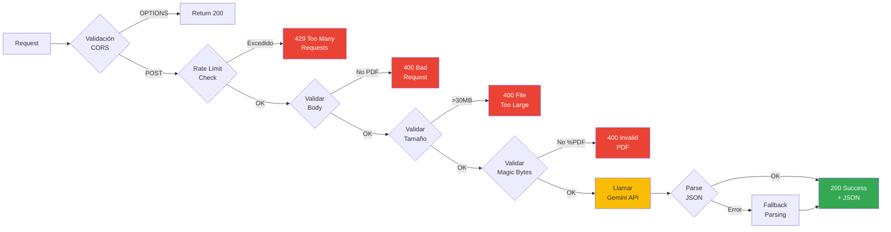
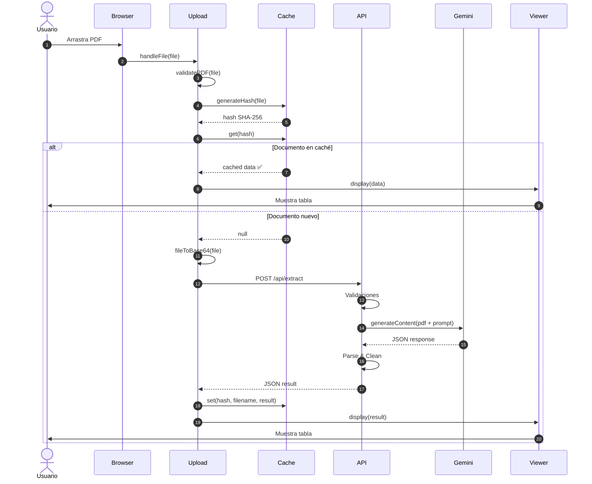

# 🏗️ Arquitectura Técnica - Catastro AI

## Índice
- [Visión General](#visión-general)
- [Arquitectura de Alto Nivel](#arquitectura-de-alto-nivel)
- [Componentes del Sistema](#componentes-del-sistema)
- [Flujo de Datos](#flujo-de-datos)
- [Decisiones de Diseño](#decisiones-de-diseño)

---

## Visión General

Catastro AI está construido como una **aplicación serverless moderna** que combina una SPA (Single Page Application) en el frontend con funciones serverless en el backend, todo orquestado a través de la API de Google Gemini.

### Principios de Diseño

1. **Serverless First**: Sin servidores que mantener, escalado automático
2. **Stateless**: Cada request es independiente, sin sesiones del lado del servidor
3. **Cache-First**: Reduce costos de API mediante caché inteligente en el cliente
4. **Progressive Enhancement**: Funciona con y sin JavaScript (degradación elegante)
5. **Mobile-First**: Diseño responsivo desde el inicio

---

## Arquitectura de Alto Nivel

```mermaid
graph TB
    subgraph "Client Layer"
        Browser[Navegador Web]
        IDB[(IndexedDB<br/>Caché Local)]
    end

    subgraph "CDN / Edge Layer"
        Vercel[Vercel Edge Network]
        Static[Static Assets<br/>HTML, CSS, JS]
    end

    subgraph "Serverless Functions"
        Extract[/api/extract.js<br/>Vercel Function]
    end

    subgraph "External Services"
        Gemini[Google Gemini API<br/>gemini-2.0-flash]
    end

    Browser --> Vercel
    Vercel --> Static
    Browser <--> IDB
    Browser --> Extract
    Extract --> Gemini
    Gemini --> Extract
    Extract --> Browser

    style Gemini fill:#fbbc04,stroke:#ea4335
    style Extract fill:#4285f4,stroke:#1a73e8,color:#fff
    style IDB fill:#34a853,stroke:#0d652d,color:#fff
```

---

## Componentes del Sistema

### 1. Frontend SPA

#### Estructura de Archivos
```
public/
├── index.html          # Punto de entrada
├── css/
│   └── styles.css      # Estilos con CSS Variables
└── js/
    ├── app.js          # Orquestador principal
    ├── upload.js       # Gestión de archivos
    ├── cache.js        # IndexedDB wrapper
    └── viewer.js       # Renderizado de resultados
```

#### Patrones de Diseño Utilizados

##### Module Pattern
Cada módulo JS exporta una clase independiente:

```javascript
// cache.js
class DocumentCache {
    constructor() {
        this.dbName = 'CatastroAI_DocumentCache';
        this.storeName = 'documents';
    }
    
    async init() { /* ... */ }
    async get(hash) { /* ... */ }
    async set(hash, filename, data) { /* ... */ }
}

window.documentCache = new DocumentCache();
```

##### Observer Pattern
Comunicación entre módulos mediante eventos custom:

```javascript
// upload.js dispara evento
window.dispatchEvent(new CustomEvent('showToast', {
    detail: { type: 'success', message: 'Documento procesado' }
}));

// app.js escucha evento
window.addEventListener('showToast', (e) => {
    this.showToast(e.detail.type, e.detail.message);
});
```

##### Strategy Pattern
Diferentes estrategias de renderizado según el tipo de dato:

```javascript
// viewer.js
renderObject(obj, level = 0) {
    if (Array.isArray(value)) {
        // Estrategia para arrays
    } else if (typeof value === 'object') {
        // Estrategia para objetos anidados
    } else {
        // Estrategia para primitivos
    }
}
```

---

### 2. Sistema de Caché (IndexedDB)

#### Esquema de Base de Datos

```javascript
{
    dbName: 'CatastroAI_DocumentCache',
    version: 1,
    objectStore: 'documents',
    schema: {
        keyPath: 'hash',        // SHA-256 del archivo
        indexes: [
            { name: 'timestamp', unique: false },
            { name: 'filename', unique: false }
        ]
    }
}
```

#### Estructura de Registro

```javascript
{
    hash: "a3f5c8...",           // SHA-256 (64 caracteres hex)
    filename: "cedula.pdf",       // Nombre original
    data: {                       // JSON extraído por Gemini
        tipo_documento: "...",
        // ...
    },
    timestamp: 1705353600000      // Unix timestamp
}
```

#### Flujo de Caché



---

### 3. API Serverless

#### Función `/api/extract`

**Archivo**: `api/extract.js`  
**Runtime**: Node.js 18 (Vercel)  
**Timeout**: 60 segundos  
**Memoria**: 1024 MB

##### Estructura del Request

```javascript
// POST /api/extract
{
    "pdfBase64": "JVBERi0xLjQK...",  // PDF en base64
    "filename": "documento.pdf"       // Nombre del archivo
}
```

##### Estructura del Response

```javascript
// Status 200 OK
{
    "tipo_documento": "Cedula Catastral",
    "clave_catastral": "123456789",
    "propietarios": ["Juan Pérez"],
    // ... más campos según el tipo de documento
}

// Status 400/500 - Error
{
    "error": "Mensaje de error descriptivo",
    "details": "Detalles técnicos (solo en dev)"
}
```

##### Pipeline de Procesamiento



##### Rate Limiting

**Implementación Simple In-Memory**:
```javascript
const rateLimitMap = new Map();
const RATE_LIMIT_WINDOW = 60000;    // 1 minuto
const RATE_LIMIT_MAX = 10;          // 10 requests

function checkRateLimit(ip) {
    const record = rateLimitMap.get(ip);
    if (!record || Date.now() > record.resetTime) {
        rateLimitMap.set(ip, { 
            count: 1, 
            resetTime: Date.now() + RATE_LIMIT_WINDOW 
        });
        return true;
    }
    if (record.count >= RATE_LIMIT_MAX) return false;
    record.count++;
    return true;
}
```

> ⚠️ **Nota**: En producción multi-instancia, usar Redis o Vercel KV para rate limiting distribuido.

---

### 4. Integración con Gemini API

#### Configuración del Cliente

```javascript
import { GoogleGenAI } from "@google/genai";

const genai = new GoogleGenAI({ 
    apiKey: process.env.GOOGLE_API_KEY 
});
```

#### Request a Gemini

```javascript
const response = await genai.models.generateContent({
    model: "gemini-2.0-flash",
    contents: [
        {
            role: "user",
            parts: [
                { text: EXTRACTION_PROMPT },  // prompt.txt
                {
                    inlineData: {
                        mimeType: "application/pdf",
                        data: pdfBase64
                    }
                }
            ]
        }
    ],
    generationConfig: {
        responseMimeType: "application/json"
    }
});
```

#### Manejo de Respuesta

```javascript
// Gemini retorna JSON como texto
const responseText = response.candidates?.[0]?.content?.parts?.[0]?.text;

// Limpieza de markdown code blocks (```json ... ```)
let cleanedResponse = responseText.trim()
    .replace(/^```(?:json)?\s*\n?/, '')
    .replace(/\n?```\s*$/, '');

// Parsing con fallback
try {
    const result = JSON.parse(cleanedResponse);
    return result;
} catch (parseError) {
    // Intenta extraer JSON embebido
    const jsonMatch = responseText.match(/\{[\s\S]*\}/);
    if (jsonMatch) {
        return JSON.parse(jsonMatch[0]);
    }
    throw new Error('No se pudo parsear JSON');
}
```

---

### 5. Sistema de Prompts

#### Prompt Engineering

El archivo `prompt.txt` utiliza técnicas de prompt engineering para resultados consistentes:

1. **Role Playing**: Define el rol del asistente
   ```
   Rol: Eres un asistente de IA experto en el análisis exhaustivo 
   de documentos legales y catastrales de México.
   ```

2. **Few-Shot Learning**: Proporciona esquemas completos por tipo de documento
   ```json
   Para Cédula Catastral:
   {
     "tipo_documento": "Cedula Catastral",
     "clave_catastral": "string",
     ...
   }
   ```

3. **Output Constraints**: Instrucciones explícitas de formato
   ```
   IMPORTANTE: Tu respuesta DEBE ser ÚNICAMENTE un objeto JSON válido. 
   NO incluyas texto explicativo, markdown, ni comentarios.
   ```

4. **Error Handling**: Manejo de datos faltantes
   ```
   Si un dato no está presente, usa `null` o omite el campo
   ```

---

## Flujo de Datos

### Flujo Completo: Subida de Documento



---

## Decisiones de Diseño

### ¿Por qué Vanilla JS en lugar de React/Vue?

**Ventajas**:
- ⚡ Carga instantánea (sin bundle de framework)
- 📦 Tamaño mínimo (~50KB total vs ~150KB+ con framework)
- 🎯 Control total sobre el DOM
- 🔧 No requiere build step

**Desventajas**:
- 🔄 Re-renders manuales
- 📝 Más código boilerplate

**Justificación**: Para una aplicación de tamaño pequeño-mediano con pocas vistas, Vanilla JS es óptimo.

---

### ¿Por qué IndexedDB en lugar de LocalStorage?

**Ventajas de IndexedDB**:
- 💾 Almacenamiento ilimitado (vs 5-10MB de LocalStorage)
- 🔍 Índices para búsquedas rápidas
- 🔐 Almacenamiento estructurado (objetos complejos)
- ⚡ API asíncrona (no bloquea UI)

---

### ¿Por qué Serverless Functions?

**Ventajas**:
- 💰 Pago por uso (vs servidor siempre corriendo)
- 📈 Escalado automático
- 🛠️ Sin mantenimiento de infraestructura
- 🌍 CDN global automático

---

### ¿Por qué Gemini Vision en lugar de OCR tradicional?

| Característica | OCR Tradicional | Gemini Vision |
|----------------|-----------------|---------------|
| Precisión | Depende de calidad del documento | Alta en documentos complejos |
| Entendimiento de contexto | ❌ No | ✅ Sí |
| Extracción estructurada | Requiere reglas complejas | Directo a JSON |
| Manejo de layouts variados | ❌ Difícil | ✅ Robusto |
| Costo | Variable | Predecible (por token) |

---

## Escalabilidad y Rendimiento

### Límites Actuales

| Recurso | Límite | Razón |
|---------|--------|-------|
| Tamaño de archivo | 30 MB | Límite de Gemini API |
| Rate limit | 10 req/min/IP | Prevenir abuso |
| Timeout API | 60 segundos | Límite Vercel Functions |
| Caché local | Ilimitado* | IndexedDB del navegador |

*Sujeto a cuota del navegador (~50-100GB típicamente)

### Optimizaciones Implementadas

1. **Caché SHA-256**: Evita procesamiento duplicado
2. **Validación temprana**: Rechaza archivos inválidos antes de enviar a API
3. **Streaming de archivos grandes**: FileReader en chunks
4. **Lazy loading de módulos**: Scripts cargados en orden óptimo

---

## Seguridad

### Validaciones de Entrada

```javascript
// 1. Extensión de archivo
if (!fileName.endsWith('.pdf')) throw new Error('Solo PDFs');

// 2. MIME type
const validMimeTypes = ['application/pdf', 'application/x-pdf'];
if (!validMimeTypes.includes(file.type)) warn();

// 3. Magic bytes
const header = buffer.slice(0, 4).toString();
if (header !== '%PDF') throw new Error('PDF inválido');

// 4. Tamaño
if (buffer.length > 30 * 1024 * 1024) throw new Error('Muy grande');
```

### Headers de Seguridad

```javascript
// vercel.json
{
    "headers": [
        { "key": "X-Content-Type-Options", "value": "nosniff" },
        { "key": "X-Frame-Options", "value": "DENY" },
        { "key": "Access-Control-Allow-Origin", "value": "*" }
    ]
}
```

### Sanitización de Salida

```javascript
// viewer.js
escapeHtml(text) {
    const div = document.createElement('div');
    div.textContent = text;  // Auto-escapa caracteres especiales
    return div.innerHTML;
}
```

---

## Monitoreo y Logging

### Logs en API

```javascript
console.log(`Processing ${filename} (${pdfBuffer.length} bytes) with ${modelName}`);
console.log('JSON parsed successfully');
console.error('Extraction error:', error);
```

### Métricas Clave

- ✅ Tasa de éxito de parsing JSON
- ⏱️ Tiempo de respuesta de Gemini API
- 📊 Distribución de tipos de documentos
- 💰 Costo por documento (tokens utilizados)

---

## Próximas Mejoras de Arquitectura

1. **Backend**
   - Redis para rate limiting distribuido
   - Queue system (Bull/BullMQ) para procesamiento asíncrono
   - Webhooks para notificaciones de documentos listos

2. **Frontend**
   - Service Worker para modo offline
   - Web Workers para hashing de archivos grandes
   - Virtual scrolling para listas de caché grandes

3. **Infraestructura**
   - CI/CD con GitHub Actions
   - Tests E2E con Playwright
   - Monitoring con Google Cloud Monitoring

---

<div align="center">
  <strong>Arquitectura diseñada para escalar de 0 a millones de documentos</strong>
</div>
