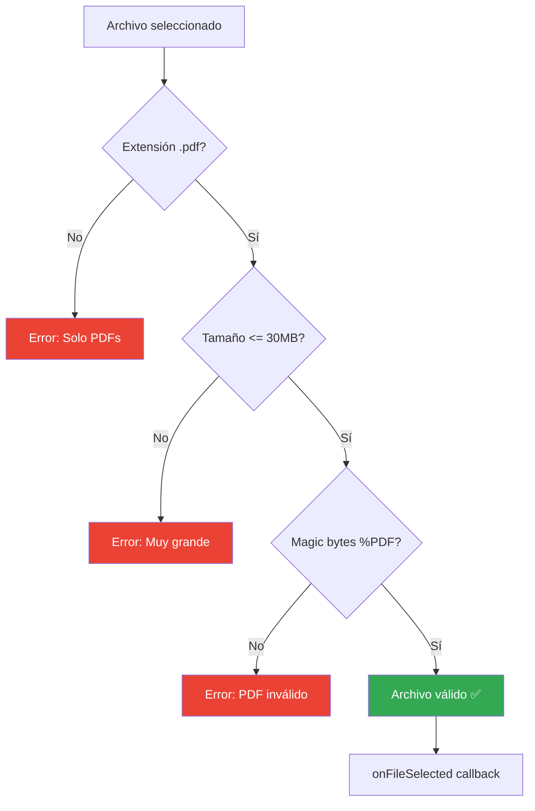
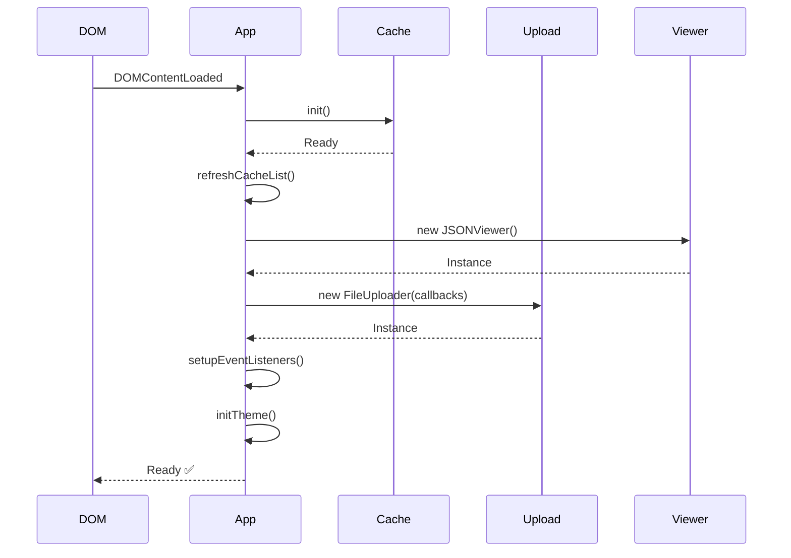

# 🎨 Desarrollo Frontend - Catastro AI

## Índice
- [Arquitectura de Componentes](#arquitectura-de-componentes)
- [Módulos JavaScript](#módulos-javascript)
- [Sistema de Estilos](#sistema-de-estilos)
- [Gestión de Estado](#gestión-de-estado)
- [Patrones de Diseño](#patrones-de-diseño)

---

## Arquitectura de Componentes

### Estructura de Archivos

```
public/
├── index.html                 # Punto de entrada (SPA)
├── css/
│   └── styles.css            # Estilos globales con CSS Variables
└── js/
    ├── cache.js              # Módulo de IndexedDB
    ├── upload.js             # Módulo de carga de archivos
    ├── viewer.js             # Módulo de visualización
    └── app.js                # Orquestador principal
```

### Diagrama de Dependencias

```mermaid
graph TD
    HTML[index.html] --> Cache[cache.js]
    HTML --> Upload[upload.js]
    HTML --> Viewer[viewer.js]
    HTML --> App[app.js]
    
    App --> Cache
    App --> Upload
    App --> Viewer
    
    Upload --> API[/api/extract]
    Cache --> IDB[(IndexedDB)]
    
    style App fill:#4285f4,color:#fff
    style API fill:#fbbc04
    style IDB fill:#34a853,color:#fff
```

---

## Módulos JavaScript

### 1. `cache.js` - Gestión de Caché

**Responsabilidad**: Interfaz con IndexedDB para almacenar resultados procesados.

#### Clase Principal

```javascript
class DocumentCache {
    constructor() {
        this.dbName = 'CatastroAI_DocumentCache';
        this.storeName = 'documents';
        this.dbVersion = 1;
        this.db = null;
    }
}
```

#### API Pública

| Método | Parámetros | Retorno | Descripción |
|--------|------------|---------|-------------|
| `init()` | - | `Promise<void>` | Inicializa la base de datos |
| `generateHash(file)` | `File` | `Promise<string>` | Genera SHA-256 del archivo |
| `get(hash)` | `string` | `Promise<object\|null>` | Obtiene documento por hash |
| `set(hash, filename, data)` | `string, string, object` | `Promise<void>` | Almacena documento |
| `getAll()` | - | `Promise<Array>` | Lista todos los documentos |
| `delete(hash)` | `string` | `Promise<void>` | Elimina un documento |
| `clear()` | - | `Promise<void>` | Limpia toda la caché |
| `getStats()` | - | `Promise<object>` | Estadísticas de caché |

#### Ejemplo de Uso

```javascript
// Inicializar
await documentCache.init();

// Generar hash
const file = fileInput.files[0];
const hash = await documentCache.generateHash(file);

// Verificar si existe
const cached = await documentCache.get(hash);
if (cached) {
    console.log('Documento en caché:', cached.data);
} else {
    // Procesar con API...
    const result = await extractPDF(file);
    
    // Guardar en caché
    await documentCache.set(hash, file.name, result);
}
```

#### Estructura de Datos

```javascript
{
    hash: "a3f5c841...",           // SHA-256 (64 hex chars)
    filename: "cedula.pdf",        // Nombre original
    data: {                        // Resultado de Gemini
        tipo_documento: "...",
        // ...
    },
    timestamp: 1705353600000       // Unix ms
}
```

---

### 2. `upload.js` - Gestión de Archivos

**Responsabilidad**: Manejo de drag & drop, validación y comunicación con API.

#### Clase Principal

```javascript
class FileUploader {
    constructor(options = {}) {
        this.uploadZone = document.getElementById('uploadZone');
        this.fileInput = document.getElementById('fileInput');
        this.maxFileSize = options.maxFileSize || 30 * 1024 * 1024;
        
        this.onFileSelected = options.onFileSelected || (() => {});
        this.onUploadStart = options.onUploadStart || (() => {});
        this.onUploadComplete = options.onUploadComplete || (() => {});
        this.onUploadError = options.onUploadError || (() => {});
    }
}
```

#### Callbacks Disponibles

```javascript
const uploader = new FileUploader({
    onFileSelected: (file) => {
        console.log('Archivo seleccionado:', file.name);
    },
    onUploadStart: (file) => {
        console.log('Iniciando upload...');
    },
    onUploadComplete: (result) => {
        console.log('Resultado:', result);
    },
    onUploadError: (error) => {
        console.error('Error:', error.message);
    }
});
```

#### Flujo de Validación



#### Validación de Magic Bytes

```javascript
async validatePDFContent(file) {
    return new Promise((resolve, reject) => {
        const timeout = setTimeout(() => {
            reject(new Error('PDF validation timeout'));
        }, 5000);

        const reader = new FileReader();
        
        reader.onload = (e) => {
            clearTimeout(timeout);
            const arr = new Uint8Array(e.target.result).subarray(0, 5);
            const header = String.fromCharCode.apply(null, arr);
            resolve(header.startsWith('%PDF'));
        };

        reader.onerror = (error) => {
            clearTimeout(timeout);
            reject(error);
        };

        reader.readAsArrayBuffer(file.slice(0, 5));
    });
}
```

#### Conversión a Base64

```javascript
async fileToBase64(file) {
    return new Promise((resolve, reject) => {
        const reader = new FileReader();
        reader.onload = () => {
            // Remover prefijo data:application/pdf;base64,
            const base64 = reader.result.split(',')[1];
            resolve(base64);
        };
        reader.onerror = reject;
        reader.readAsDataURL(file);
    });
}
```

---

### 3. `viewer.js` - Visualización de Resultados

**Responsabilidad**: Renderizar JSON como tablas HTML estructuradas.

#### Clase Principal

```javascript
class JSONViewer {
    constructor(options = {}) {
        this.resultContent = document.getElementById('resultContent');
        this.jsonOutput = document.getElementById('jsonOutput');
        this.currentData = null;
        this.currentFilename = null;
    }
}
```

#### API Pública

| Método | Parámetros | Descripción |
|--------|------------|-------------|
| `display(data, filename)` | `object, string` | Renderiza datos en tabla |
| `clear()` | - | Limpia la visualización |
| `copyToClipboard()` | - | Copia JSON al portapapeles |
| `downloadJSON()` | - | Descarga JSON como archivo |

#### Renderizado de Tablas

```javascript
generateTableHTML(data) {
    // Determinar tipo de documento
    const title = data.tipo_documento || 'Documento Extraído';
    
    return `
        <div class="data-section">
            <h3 class="section-title">${this.escapeHtml(title)}</h3>
            ${this.renderObject(data)}
        </div>
    `;
}

renderObject(obj, level = 0) {
    let html = '<table class="data-table">';
    
    for (const [key, value] of Object.entries(obj)) {
        html += '<tr>';
        html += `<td class="key-cell">${this.formatKey(key)}</td>`;
        html += '<td class="value-cell">';
        
        if (Array.isArray(value)) {
            // Renderizar array
            html += this.renderArray(value);
        } else if (typeof value === 'object' && value !== null) {
            // Renderizar objeto anidado
            html += this.renderObject(value, level + 1);
        } else {
            // Renderizar primitivo
            html += this.renderPrimitive(value);
        }
        
        html += '</td>';
        html += '</tr>';
    }
    
    html += '</table>';
    return html;
}
```

#### Formateo de Claves

```javascript
formatKey(key) {
    // Convierte "clave_catastral" -> "Clave Catastral"
    return key
        .replace(/_/g, ' ')
        .split(' ')
        .map(word => word.charAt(0).toUpperCase() + word.slice(1).toLowerCase())
        .join(' ');
}
```

#### Sanitización HTML

```javascript
escapeHtml(text) {
    const div = document.createElement('div');
    div.textContent = text;  // Auto-escapa caracteres especiales
    return div.innerHTML;
}
```

---

### 4. `app.js` - Orquestador Principal

**Responsabilidad**: Coordinar todos los módulos y gestionar el estado global.

#### Clase Principal

```javascript
class CatastroApp {
    constructor() {
        this.cache = window.documentCache;
        this.uploader = null;
        this.viewer = null;
        
        this.cacheList = document.getElementById('cacheList');
        this.clearCacheButton = document.getElementById('clearCache');
        this.themeToggle = document.getElementById('themeToggle');
        this.toastContainer = document.getElementById('toastContainer');
        
        this.init();
    }
}
```

#### Flujo de Inicialización



#### Gestión de Eventos

```javascript
setupEventListeners() {
    // Botón limpiar caché
    this.clearCacheButton.addEventListener('click', () => {
        this.clearCache();
    });

    // Toggle de tema
    this.themeToggle.addEventListener('click', () => {
        this.toggleTheme();
    });

    // Eventos custom
    window.addEventListener('showToast', (e) => {
        this.showToast(e.detail.type, e.detail.message);
    });
}
```

#### Sistema de Notificaciones (Toasts)

```javascript
showToast(type, message) {
    const icons = {
        success: `<svg>...</svg>`,
        error: `<svg>...</svg>`,
        warning: `<svg>...</svg>`
    };

    const toast = document.createElement('div');
    toast.className = `toast ${type}`;
    toast.innerHTML = `
        <div class="toast-icon">${icons[type]}</div>
        <div class="toast-message">${message}</div>
        <button class="toast-close">×</button>
    `;

    this.toastContainer.appendChild(toast);

    // Auto-remover después de 5s
    setTimeout(() => this.removeToast(toast), 5000);
}
```

---

## Sistema de Estilos

### CSS Variables (Design Tokens)

```css
:root {
    /* Colores principales */
    --primary: #4285f4;
    --primary-dark: #1a73e8;
    --success: #34a853;
    --error: #ea4335;
    --warning: #fbbc04;
    
    /* Colores de fondo */
    --bg-primary: #ffffff;
    --bg-secondary: #f8f9fa;
    --bg-tertiary: #e8eaed;
    
    /* Texto */
    --text-primary: #202124;
    --text-secondary: #5f6368;
    --text-tertiary: #80868b;
    
    /* Espaciado */
    --spacing-xs: 0.5rem;
    --spacing-sm: 1rem;
    --spacing-md: 1.5rem;
    --spacing-lg: 2rem;
    --spacing-xl: 3rem;
    
    /* Bordes */
    --radius-sm: 4px;
    --radius-md: 8px;
    --radius-lg: 12px;
    
    /* Sombras */
    --shadow-sm: 0 1px 2px rgba(0,0,0,0.05);
    --shadow-md: 0 4px 6px rgba(0,0,0,0.1);
    --shadow-lg: 0 10px 15px rgba(0,0,0,0.1);
    
    /* Transiciones */
    --transition: 0.2s ease;
}
```

### Tema Oscuro

```css
[data-theme="dark"] {
    --bg-primary: #202124;
    --bg-secondary: #292a2d;
    --bg-tertiary: #35363a;
    
    --text-primary: #e8eaed;
    --text-secondary: #9aa0a6;
    --text-tertiary: #5f6368;
    
    --shadow-sm: 0 1px 2px rgba(0,0,0,0.3);
    --shadow-md: 0 4px 6px rgba(0,0,0,0.4);
    --shadow-lg: 0 10px 15px rgba(0,0,0,0.5);
}
```

### Layout Responsivo

```css
/* Mobile first */
.layout-grid {
    display: grid;
    grid-template-columns: 1fr;
    gap: var(--spacing-lg);
}

/* Tablet */
@media (min-width: 768px) {
    .layout-grid {
        grid-template-columns: 400px 1fr;
    }
}

/* Desktop */
@media (min-width: 1200px) {
    .layout-grid {
        grid-template-columns: 450px 1fr;
        max-width: 1400px;
        margin: 0 auto;
    }
}
```

---

## Gestión de Estado

### Estado Global

El estado se gestiona en `app.js` sin necesidad de una librería de estado:

```javascript
class CatastroApp {
    constructor() {
        // Referencias a módulos (singleton pattern)
        this.cache = window.documentCache;
        this.uploader = null;
        this.viewer = null;
        
        // DOM references (cached)
        this.cacheList = document.getElementById('cacheList');
        // ...
    }
}
```

### Flujo de Datos Unidireccional


### Comunicación entre Módulos

**Opción 1: Callbacks** (Uploader → App)
```javascript
this.uploader = new FileUploader({
    onUploadComplete: (result) => {
        this.handleUploadComplete(result);
    }
});
```

**Opción 2: Custom Events** (Viewer → App)
```javascript
// En viewer.js
window.dispatchEvent(new CustomEvent('showToast', {
    detail: { type: 'success', message: 'JSON copiado' }
}));

// En app.js
window.addEventListener('showToast', (e) => {
    this.showToast(e.detail.type, e.detail.message);
});
```

---

## Patrones de Diseño

### 1. Module Pattern

Cada archivo JS exporta una clase autocontenida:

```javascript
// cache.js
class DocumentCache {
    // Implementación privada
}

// Exportar instancia singleton
window.documentCache = new DocumentCache();
```

### 2. Observer Pattern

```javascript
// Suscriptor
window.addEventListener('customEvent', (e) => {
    console.log(e.detail);
});

// Publicador
window.dispatchEvent(new CustomEvent('customEvent', {
    detail: { data: 'value' }
}));
```

### 3. Strategy Pattern

Diferentes estrategias de renderizado según tipo de dato:

```javascript
renderValue(value) {
    if (Array.isArray(value)) {
        return this.renderArrayStrategy(value);
    } else if (typeof value === 'object') {
        return this.renderObjectStrategy(value);
    } else {
        return this.renderPrimitiveStrategy(value);
    }
}
```

### 4. Singleton Pattern

Una sola instancia de cache en toda la aplicación:

```javascript
window.documentCache = new DocumentCache();

// Uso en cualquier módulo
const cache = window.documentCache;
```

---

## Optimizaciones de Rendimiento

### 1. Event Delegation

```javascript
// ❌ Añadir listener a cada item
items.forEach(item => {
    item.addEventListener('click', handler);
});

// ✅ Un solo listener en el contenedor
container.addEventListener('click', (e) => {
    if (e.target.matches('.cache-item')) {
        handler(e);
    }
});
```

### 2. Debouncing

```javascript
function debounce(func, wait) {
    let timeout;
    return function executedFunction(...args) {
        clearTimeout(timeout);
        timeout = setTimeout(() => func(...args), wait);
    };
}

// Uso
window.addEventListener('resize', debounce(() => {
    console.log('Resize finalizado');
}, 250));
```

### 3. Lazy Loading de Imágenes

```html


<script>
const lazyImages = document.querySelectorAll('.lazy');
const imageObserver = new IntersectionObserver((entries) => {
    entries.forEach(entry => {
        if (entry.isIntersecting) {
            const img = entry.target;
            img.src = img.dataset.src;
            imageObserver.unobserve(img);
        }
    });
});

lazyImages.forEach(img => imageObserver.observe(img));
</script>
```

---

## Testing

### Unit Tests (Ejemplo con Jest)

```javascript
// cache.test.js
import { DocumentCache } from './cache.js';

describe('DocumentCache', () => {
    let cache;
    
    beforeEach(async () => {
        cache = new DocumentCache();
        await cache.init();
    });
    
    test('should generate consistent hash', async () => {
        const file = new File(['content'], 'test.pdf');
        const hash1 = await cache.generateHash(file);
        const hash2 = await cache.generateHash(file);
        expect(hash1).toBe(hash2);
    });
    
    test('should store and retrieve document', async () => {
        const hash = 'test123';
        const data = { tipo_documento: 'test' };
        
        await cache.set(hash, 'test.pdf', data);
        const result = await cache.get(hash);
        
        expect(result.data).toEqual(data);
    });
});
```

---

## Mejores Prácticas

### 1. Nomenclatura

```javascript
// ✅ Clases: PascalCase
class DocumentCache {}

// ✅ Variables/funciones: camelCase
const fileUploader = new FileUploader();

// ✅ Constantes: UPPER_SNAKE_CASE
const MAX_FILE_SIZE = 30 * 1024 * 1024;

// ✅ IDs CSS: kebab-case
document.getElementById('upload-zone');
```

### 2. Manejo de Errores

```javascript
// ✅ Siempre usar try-catch con async/await
async function processFile(file) {
    try {
        const result = await extractPDF(file);
        return result;
    } catch (error) {
        console.error('Error processing file:', error);
        throw new Error(`Failed to process ${file.name}: ${error.message}`);
    }
}
```

### 3. Documentación

```javascript
/**
 * Genera un hash SHA-256 del contenido del archivo
 * @param {File} file - El archivo a hashear
 * @returns {Promise<string>} - Hash hexadecimal (64 caracteres)
 * @throws {Error} Si el archivo no se puede leer
 * @example
 * const hash = await cache.generateHash(file);
 * // "a3f5c841d2e3f4..."
 */
async generateHash(file) {
    // ...
}
```

---

<div align="center">
  <strong>Frontend modular, performante y mantenible</strong>
</div>
