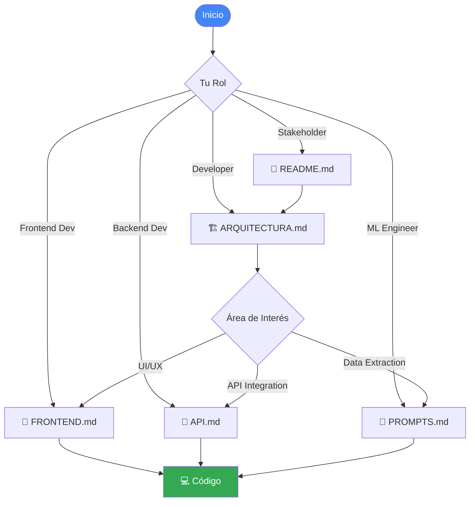

# 📚 Documentación Técnica - Catastro AI

Esta carpeta contiene la documentación técnica completa del sistema Catastro AI. La documentación está organizada por áreas de interés para facilitar su navegación.

---

## 📖 Guías Disponibles

### 🏗️ [ARQUITECTURA.md](ARQUITECTURA.md)
**Audiencia**: Arquitectos de software, Tech Leads, DevOps

Documentación completa de la arquitectura del sistema, incluyendo:
- Diseño de alto nivel y componentes
- Diagramas de flujo de datos
- Decisiones de diseño y justificaciones
- Patrones de arquitectura utilizados
- Sistema de caché con IndexedDB
- Integración con Gemini API
- Consideraciones de escalabilidad y seguridad

**Cuándo consultarla**:
- Al onboardear nuevos desarrolladores
- Al diseñar nuevas features que impacten la arquitectura
- Al evaluar cambios de infraestructura
- Al realizar code reviews de alto nivel

---

### 📡 [API.md](API.md)
**Audiencia**: Desarrolladores backend, Frontend developers, Integradores

Especificación completa de la API REST, incluyendo:
- Endpoint `/api/extract` con ejemplos
- Formatos de request y response
- Códigos de error y manejo
- Ejemplos en múltiples lenguajes (JavaScript, Python, Node.js, cURL)
- Rate limiting y mejores prácticas
- Validaciones de entrada

**Cuándo consultarla**:
- Al integrar la API desde otro sistema
- Al debuggear problemas de API
- Al implementar clientes para la API
- Al diseñar pruebas de integración

---

### 🎨 [FRONTEND.md](FRONTEND.md)
**Audiencia**: Desarrolladores frontend, UI/UX developers

Documentación detallada del frontend Vanilla JS, incluyendo:
- Arquitectura de componentes modular
- Módulos JavaScript (`app.js`, `upload.js`, `viewer.js`, `cache.js`)
- Sistema de estilos con CSS Variables
- Patrones de diseño (Module, Observer, Strategy, Singleton)
- Gestión de estado y comunicación entre módulos
- Optimizaciones de rendimiento
- Mejores prácticas de desarrollo

**Cuándo consultarla**:
- Al agregar nuevos componentes UI
- Al modificar el sistema de caché local
- Al implementar nuevas features en el frontend
- Al optimizar rendimiento del cliente

---

### 🎯 [PROMPTS.md](PROMPTS.md)
**Audiencia**: Prompt engineers, Data scientists, ML engineers

Documentación del sistema de prompts de Gemini, incluyendo:
- Estructura del archivo `prompt.txt`
- Técnicas de ingeniería de prompts aplicadas
- Esquemas JSON para cada tipo de documento
- Guía de personalización y extensión
- Mejores prácticas para modificar prompts
- Troubleshooting de problemas comunes
- Métricas de calidad del prompt

**Cuándo consultarla**:
- Al agregar soporte para nuevos tipos de documentos
- Al modificar la estructura de extracción
- Al optimizar la precisión de extracción
- Al debuggear problemas de parsing JSON

---

## 🎯 Guía Rápida por Rol

### Para Stakeholders / Product Managers
1. Leer el [README principal](../README.md) para entender el producto
2. Revisar [ARQUITECTURA.md](ARQUITECTURA.md) sección "Visión General"
3. Ver diagramas de flujo para entender el proceso end-to-end

### Para Desarrolladores Nuevos
1. **Día 1**: [README principal](../README.md) + setup local
2. **Día 2**: [ARQUITECTURA.md](ARQUITECTURA.md) completo
3. **Día 3-4**: [FRONTEND.md](FRONTEND.md) o [API.md](API.md) según tu área
4. **Día 5**: [PROMPTS.md](PROMPTS.md) para entender la extracción

### Para DevOps / SRE
1. [README principal](../README.md) sección "Despliegue"
2. [ARQUITECTURA.md](ARQUITECTURA.md) sección "Escalabilidad"
3. Archivos `DEPLOY_VERCEL.md` y `DEPLOY_CLOUDRUN.md` en raíz

### Para Data Scientists / ML Engineers
1. [PROMPTS.md](PROMPTS.md) completo
2. [API.md](API.md) para entender inputs/outputs
3. [ARQUITECTURA.md](ARQUITECTURA.md) sección "Integración con Gemini"

---

## 📊 Mapa de Navegación



---

## 🔍 Búsqueda Rápida de Temas

### Arquitectura y Diseño
- **Componentes del sistema** → [ARQUITECTURA.md](ARQUITECTURA.md#componentes-del-sistema)
- **Flujo de datos** → [ARQUITECTURA.md](ARQUITECTURA.md#flujo-de-datos)
- **Decisiones de diseño** → [ARQUITECTURA.md](ARQUITECTURA.md#decisiones-de-diseño)
- **Patrones de diseño** → [FRONTEND.md](FRONTEND.md#patrones-de-diseño)

### API y Backend
- **Endpoint de extracción** → [API.md](API.md#endpoint-de-extracción)
- **Códigos de error** → [API.md](API.md#códigos-de-error)
- **Ejemplos de uso** → [API.md](API.md#ejemplos-de-uso)
- **Rate limiting** → [API.md](API.md#rate-limiting)

### Frontend
- **Módulos JavaScript** → [FRONTEND.md](FRONTEND.md#módulos-javascript)
- **Sistema de caché** → [FRONTEND.md](FRONTEND.md#1-cachejs---gestión-de-caché)
- **Gestión de archivos** → [FRONTEND.md](FRONTEND.md#2-uploadjs---gestión-de-archivos)
- **Visualización** → [FRONTEND.md](FRONTEND.md#3-viewerjs---visualización-de-resultados)
- **Sistema de estilos** → [FRONTEND.md](FRONTEND.md#sistema-de-estilos)

### Prompts e IA
- **Estructura del prompt** → [PROMPTS.md](PROMPTS.md#estructura-del-prompt)
- **Esquemas JSON** → [PROMPTS.md](PROMPTS.md#esquemas-json)
- **Personalización** → [PROMPTS.md](PROMPTS.md#personalización)
- **Troubleshooting** → [PROMPTS.md](PROMPTS.md#troubleshooting)

### Despliegue
- **Vercel** → [../DEPLOY_VERCEL.md](../DEPLOY_VERCEL.md)
- **Cloud Run** → [../DEPLOY_CLOUDRUN.md](../DEPLOY_CLOUDRUN.md)
- **Variables de entorno** → [README principal](../README.md#configuración)

---

## 🛠️ Casos de Uso Comunes

### "Quiero agregar un nuevo tipo de documento"
1. 📖 Leer [PROMPTS.md - Personalización](PROMPTS.md#personalización)
2. 🔧 Modificar `prompt.txt` con nuevo esquema
3. 🧪 Probar con documentos de ejemplo
4. 🎨 Actualizar frontend si se requiere renderizado especial ([FRONTEND.md](FRONTEND.md#3-viewerjs---visualización-de-resultados))

### "Necesito integrar la API desde mi sistema"
1. 📖 Leer [API.md - Endpoint de Extracción](API.md#endpoint-de-extracción)
2. 💻 Copiar ejemplo de tu lenguaje ([API.md - Ejemplos](API.md#ejemplos-de-uso))
3. 🔐 Configurar autenticación si es necesario
4. 🧪 Probar con documentos de prueba

### "Quiero modificar la UI"
1. 📖 Leer [FRONTEND.md - Arquitectura de Componentes](FRONTEND.md#arquitectura-de-componentes)
2. 🎨 Modificar CSS Variables para cambios de estilo ([FRONTEND.md - Sistema de Estilos](FRONTEND.md#sistema-de-estilos))
3. 💻 Modificar módulo relevante (app.js, upload.js, viewer.js)
4. 🧪 Probar en todos los navegadores

### "Necesito optimizar el rendimiento"
1. 📊 Revisar [ARQUITECTURA.md - Escalabilidad](ARQUITECTURA.md#escalabilidad-y-rendimiento)
2. ⚡ Ver [FRONTEND.md - Optimizaciones](FRONTEND.md#optimizaciones-de-rendimiento)
3. 🔍 Analizar métricas actuales
4. 🚀 Implementar optimizaciones sugeridas

---

## 📝 Convenciones de la Documentación

### Formato de Código

**JavaScript/Node.js**:
```javascript
// ✅ Ejemplo correcto
const result = await extractPDF(file);

// ❌ Ejemplo incorrecto
const result = extractPDF(file); // Sin await
```

**Python**:
```python
# ✅ Ejemplo correcto
result = extract_pdf('file.pdf')

# ❌ Ejemplo incorrecto
result = extractPDF('file.pdf')  # Nombre incorrecto
```

### Íconos Utilizados

- ✅ Correcto / Recomendado
- ❌ Incorrecto / No recomendado
- ⚠️ Advertencia / Precaución
- 💡 Consejo / Sugerencia
- 🔍 Nota importante
- 📊 Métricas / Datos
- 🚀 Performance / Optimización

---

## 🔄 Mantenimiento de la Documentación

### Cuándo Actualizar

Esta documentación debe actualizarse cuando:

1. **Cambios en la arquitectura**
   - Nuevos componentes o módulos
   - Cambios en flujos de datos
   - Nuevas integraciones

2. **Cambios en la API**
   - Nuevos endpoints
   - Cambios en formatos de request/response
   - Nuevos códigos de error

3. **Cambios en el frontend**
   - Nuevos módulos JavaScript
   - Cambios en la estructura de componentes
   - Nuevos patrones de diseño implementados

4. **Cambios en prompts**
   - Nuevos tipos de documentos
   - Modificaciones en esquemas JSON
   - Nuevas técnicas de prompt engineering

### Proceso de Actualización

1. Modificar el archivo `.md` correspondiente
2. Actualizar diagramas si aplica (Mermaid)
3. Revisar links internos
4. Actualizar fecha en el encabezado
5. Commit con mensaje descriptivo:
   ```
   docs: Update FRONTEND.md with new cache module
   ```

---

## 📞 Contacto y Contribuciones

¿Encontraste un error en la documentación? ¿Tienes una sugerencia?

1. Abre un issue en el repositorio
2. Etiqueta como `documentation`
3. Proporciona contexto y ubicación del problema
4. Si tienes una solución, incluye un PR

---

## 📚 Recursos Adicionales

### Documentación Externa

- [Google Gemini API Documentation](https://ai.google.dev/docs)
- [Vercel Documentation](https://vercel.com/docs)
- [IndexedDB API - MDN](https://developer.mozilla.org/en-US/docs/Web/API/IndexedDB_API)
- [Prompt Engineering Guide](https://www.promptingguide.ai/)

### Archivos Relacionados en el Proyecto

- `README.md` - Documentación principal del proyecto
- `DEPLOY_VERCEL.md` - Guía de despliegue en Vercel
- `DEPLOY_CLOUDRUN.md` - Guía de despliegue en Cloud Run
- `README_DETALLADO.md` - Documentación detallada original
- `.env.example` - Ejemplo de configuración

---

<div align="center">
  <p><strong>Documentación creada con ❤️ para desarrolladores</strong></p>
  <p><em>Última actualización: Enero 2026</em></p>
</div>
